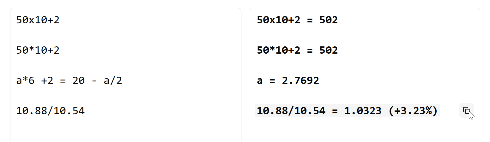

## 🌐 Choose your language / 选择语言

| 🌐 Language | 选择语言 |
|--------------|----------|
| [English](#english) | [中文](#中文) |

---

# English

### Text-based Calculator (with Equation Solver)

A text-based calculator application, a static frontend project.

Allows users to calculate results by entering expressions in a text area, supporting linear equations with one variable.

The project is built using React, TypeScript, Vite, pnpm, Tailwind CSS, and Shadcn UI.

### Example

A demo page deployed using Cloudflare Pages -> [Cloudflare Demo URL](https://text-calcer.pages.dev/)



### New Features
**July 27, 2025: New One-Click Copy Feature**  
Hover over any result line to reveal a copy icon. Simply click it to copy the entire line to your clipboard.

### Features
*   **Basic Arithmetic:** Performs addition, subtraction, multiplication, division, and other standard mathematical operations.  
*   **Multiplication symbols:** For better **markdown** file compatibility, You can choose the multiplication symbol you like. "2*3=6" is equals to "2x3=6".
*   **Equation Solving:** Solves linear equations with a single variable 'a'.
*   **Comment Support:** Allows users to add comments to their calculations using the `#` symbol.  The part after `#` will be treated as a comment and ignored during calculation.
*   **Responsive Design:** Adapts to different screen sizes using a two-column layout.
*   **Formatted Output:** Displays numbers in a user-friendly way. Formats the output, displaying percentages if the value is too small.
*   **Input Caching:** Caches the user's input.  Restores the input when the webpage is opened next time.
*   **PWA Support:**  After deployment using Https, it can be installed as a local application through PWA.
*   **Cloud Provider Pages Deployment:** Supports static deployment on various service providers' pages.


### Tech Stack

*   **Frontend Framework:** [React](https://react.dev/)
*   **Language:** [TypeScript](https://www.typescriptlang.org/)
*   **Build Tool:** [Vite](https://vitejs.dev/)
*   **Package Manager:** [pnpm](https://pnpm.io/)
*   **Styling:** [Tailwind CSS](https://tailwindcss.com/)
*   **UI Components:** [Shadcn UI](https://ui.shadcn.com/)
*   **Math Library:** [Math.js](https://mathjs.org/)

### Quick Start

1.  **Clone the repository:**

    ```bash
    git clone https://github.com/Knowckx/text-calcer.git
    cd text-calcer
    ```

2.  **Install dependencies:**

    ```bash
    pnpm install
    ```

3.  **Run the development server:**

    ```bash
    pnpm dev
    ```

    This will start the development server, usually on `http://localhost:3000`. Open this URL in your browser to view the application.

4.  **Local deployment, supporting PWA application installation:**

    ```bash
    pnpm run build
    pnpm preview --host
    ```

### Contributing

Fork/Star are welcome.

If you find any bugs or have suggestions for improvement, please submit an issue or pull request.

### License

This project is licensed under the [GPL3 License](LICENSE).

---


# 中文
欢迎阅读项目文档！

这个项目来自于自己在买基金时，经常需要计算目前的场内价格对应基金净值产生的溢价率/折价率。    
我不喜欢拿着手机算，win自带的计算器输入又不够自由，所以产生了此项目

### 基于文本的计算器（带方程求解）

基于文本的计算器应用，一个静态前端项目.

允许用户通过在文本区域中输入表达式来求计算结果，支持一元一次方程。

项目使用 React、TypeScript、Vite、pnpm、Tailwind CSS 和 Shadcn UI 构建。

### 例子

使用Cloudflare Pages部署的一个示例页面 -> [Cloudflare Demo URL](https://text-calcer.pages.dev/)


### 备用地址
假如在国内对Cloudflare的访问有问题，可以考虑以下的备用地址:  
[备用地址1](https://text-calcer.edgeone.app/)
[备用地址2](https://text-calcer.zone.id/)

### 新功能
**2025-07-27 增加一个懒人功能: 一键复制**  
将鼠标悬停在计算结果的某一行时，会看到一个复制图标。点击它，就可以一键复制整行结果到剪贴板。

### 功能特性
*   **基础算术：** 执行加法、减法、乘法、除法和其他标准数学运算。
*   **乘法符号：** 可以选择你喜欢的乘法符号，为了更好的markdown兼容性，字符'x'和字符'\*'都会被视为乘法符号. "2*3=6"等价于"2x3=6".
*   **方程求解：** 求解具有单个变量 'a' 的线性方程。
*   **注释支持：** 允许用户使用 `#` 符号向其计算添加注释。 `#` 后面的部分将被视为注释，并在计算过程中被忽略。
*   **格式化输出：** 以用户友好的方式显示数字。格式化输出， 除法值显示百分比。
*   **缓存输入内容：** 缓存用户输入的内容 下次打开网页时进行复原
*   **PWA支持：** 使用Https部署后可以通过PWA安装到本地应用
*   **云服务商pages部署：** 支持各种服务商的pages静态部署


### 技术栈

*   **前端框架:** [React](https://react.dev/)
*   **语言:** [TypeScript](https://www.typescriptlang.org/)
*   **构建工具:** [Vite](https://vitejs.dev/)
*   **包管理器:** [pnpm](https://pnpm.io/)
*   **样式:** [Tailwind CSS](https://tailwindcss.com/)
*   **UI 组件:** [Shadcn UI](https://ui.shadcn.com/)
*   **数学库:** [Math.js](https://mathjs.org/)

### 快速开始

1.  **克隆仓库:**

    ```bash
    git clone https://github.com/Knowckx/text-calcer.git
    cd text-calcer
    ```

2.  **安装依赖:**

    ```bash
    pnpm install
    ```

3.  **运行开发服务器:**

    ```bash
    pnpm dev
    ```

    这将启动开发服务器，通常在 `http://localhost:3000` 上。在浏览器中打开此 URL 以查看应用程序。

4.  **本地部署，支持安装PWA应用:**

    ```bash
    pnpm run build
    pnpm preview --host
    ```


### 贡献

欢迎Fork / Star

如果您发现任何错误或有改进建议，请提交一个 issue 或 pull request。

### 许可证

本项目根据 [GPL3 许可证](LICENSE) 获得许可
